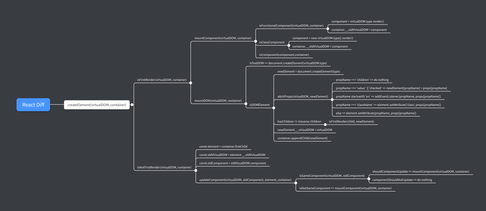
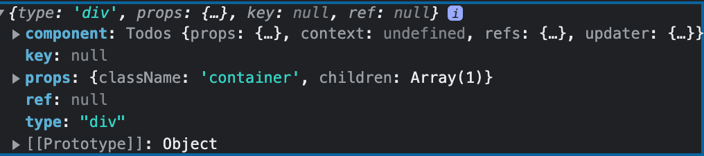
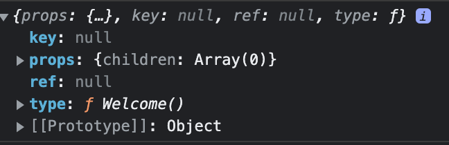
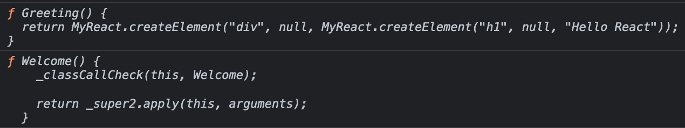
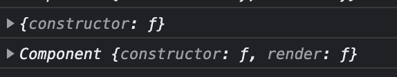

# 用TypeScript手摸手造一个React轮子

> 本篇文章是在阅读[小村儿](https://juejin.cn/user/1310273589219623/posts)大佬的react学习系列之后自己的实践和补充, 正好最近也想通过用Typescript造轮子的过程加深对TS和类型思想的理解, 毕竟React对TS的支持度还是很高的(点名批评Vue). 理解源码最好的方式可能就是自己造一个. 这里大部分是我对编码思路的一些整理, 希望也能对你有所帮助. 如果有哪里不对或者不准确的地方, 也希望你能够毫不吝啬地指出来🥺

## Overall Structure(updating)


## 目录
- [Why VirtualDOM](#Why&nbsp;VirtualDOM)
- [VitualDOM in a Nutshell](#VitualDOM&nbsp;in&nbsp;a&nbsp;Nutshell)
- [0. 项目准备](0.&nbsp;项目准备)
- [1. createElement](1.&nbsp;createElement)
- [2. 渲染DOM元素](2.&nbsp;渲染DOM元素)
- [3. 渲染组件](3.&nbsp;渲染组件)
- [4. Diff算法(props)](4.&nbsp;Diff算法(props))
- [5. Diff算法(key)](5.&nbsp;Diff算法(key))

## Why VirtualDOM 
> 用脚本进行DOM操作的代价很昂贵.有个贴切的比喻，把DOM和JavaScript各自想象为一个岛屿，它们之间用收费桥梁连接，js每次访问DOM，都要途径这座桥，并交纳“过桥费”,访问DOM的次数越多，费用也就越高. 因此，推荐的做法是尽量减少过桥的次数，努力待在ECMAScript岛上. 现代浏览器使用JavaScript操作DOM是必不可少的，但是这个动作是非常消耗性能的，因为使用JavaScript操作DOM对象要比JavaScript操作普通对象要慢很多，页面如果频繁的DOM操作会造成页面卡顿，应用流畅度降低，造成非常不好的体验.

Virtual DOM其实本质上就是React用来描述DOM对象的JavaScript对象，使用Virtual DOM的最主要原因便是提升效率——通过精确的找出发生变化的DOM对象，从而在在最少程度上减少直接操作DOM的次数.
## VitualDOM in a Nutshell
用三句话总结虚拟DOM的本质便是：
1. 虚拟DOM是Object类型的对象
2. 虚拟DOM无需真实DOM的诸多属性
3. 虚拟DOM最终会被React转化为真实DOM

借助babel，我们可以很清楚的看到jsx是怎样被编译的
```jsx
// jsx代码
<div className="container">
  <h3>Hello React</h3>
  <p>React is great</p>
</div>

// babel 编译过后
React.createElement (
  "div",
  {
    className: "container"
  },
  React.createElement("h3", null, "Hello React"),
  React.createElement("p", null, "React is great")
)
```

## 0. 项目准备
* `tsconfig.json` 
基本就是`tsc --init` 生成的, 只需要确保`jsx`选项用的是“preserve”.
```json
{
    "compilerOptions": {
        "target": "es2016", 
        "jsx": "preserve", 
        "module": "commonjs",
        "esModuleInterop": true, 
        "strict": true,
        "forceConsistentCasingInFileNames": true,
        "skipLibCheck": true
    }
}
```
* 文件结构
```
├─demo
└─src
|  ├─MyReact
|  └─shared
```
* 安装所需依赖:
    * React和TS: `yarn add react typescript`
    * Webpack相关: `yarn add -D webpack webpack-cli webpack-dev-server style-loader sass-loader node-sass css-loader clean-webpack-plugin html-webpack-plugin babel-plugin-react-transform babel-loader @babel/core @babel/preset-env @babel/preset-react`
    * TS代码提示: `yarn add -D @types/react @types/dom `
    * webpack.config.js
    ```js
    const path = require("path")
    const HtmlWebpackPlugin = require("html-webpack-plugin")
    const { CleanWebpackPlugin } = require("clean-webpack-plugin")

    module.exports = {
      mode: 'development',
      entry: "./demo/index.tsx",
      output: {
        path: path.resolve("dist"),
        filename: "bundle.js",
        // devtoolModuleFilenameTemplate: '../[resource-path]'
      },
      // 需要解析的文件类型
      resolve: {
        extensions: ['.ts', '.tsx', '.json', '.js'],
      },
      devtool: "inline-source-map",
      module: {
        rules: [
          {
            test: /\.tsx?$/,
            use: ['babel-loader', 'ts-loader'],
          },
          {
            test: /\.scss?$/,
            use: ['style-loader', 'css-loader', 'sass-loader']
          }
        ]
      },
      plugins: [
        // 在构建之前将dist文件夹清理掉
        new CleanWebpackPlugin({
          cleanOnceBeforeBuildPatterns: ["./dist"]
        }),
        // 指定HTML模板, 插件会将构建好的js文件自动插入到HTML文件中
        new HtmlWebpackPlugin({
          template: "./demo/index.html"
        })
      ],
      devServer: {
        // 指定开发环境应用运行的根据目录
        // contentBase: "./dist",
        // 指定控制台输出的信息
        // stats: "errors-only",
        // 不启动压缩
        compress: false,
        host: "localhost",
        port: 5000,
        hot: true,
      }
    }


    ```


## 1. createElement 
为了了解createElement实现的原理，我们可以自己写一个简单的createElement方法，首先在react项目中的`.babelrc`中指明自定义的方法

```json
// .babelrc
{
  "presets": [
    "@babel/preset-env",
    [
      "babel/preset-react",
      {
        "pragma": "MyReact.createElement"
      }
    ]
  ]
}
```

这样一来虚拟DOM都会通过TinyReact.createElement这个方法被构造，为了符合Virtual DOM的数据结构，createElement需要有这些变化

```typescript
/**
 * createElement 
 * @param type 元素类型
 * @param props 属性
 * @param children 子元素 
 * @returns 
 */
export const createElement = (type: any, props: any, ...children: any): MyReactElement => {
  // 对子元素进行处理
  const childElements = children.map((child: any) => {
    // 如果子元素为虚拟DOM对象，直接返回
    if (child instanceof Object) {
      return child
    }
    // 如果子元素为纯文本，将文本储存在props.textContent中返回
    else {
      return createElement('text', { textContent: child })
    }
  })

  props = Object.assign({}, props, { children: childElements })

  const key = props.key || null
  const ref = props.ref || null

  return {
    type,
    props,
    key,
    ref,
  }
}
```

这里还有几个以后会用到的types

```ts
import { createElement, createRef } from "react"

export interface MyReactElement {
  type: any,
  props: { [key: string]: any },
  key: any | null,
  ref?: MyRef<any>;
  component?: MyReactComponent;
}

export interface MyReactComponent {
  [key: string]: any;
}

export type MyHTMLElement = HTMLElement & { __virtualDOM: MyReactElement } | HTMLInputElement & { __virtualDOM: MyReactElement }

// createRef构造的对象
export interface MyRefObject<T> {
  readonly current: T | null;
}
// 函数式的ref
export type MyRefCallback<T> = (instace: T) => {}

// 现在可使用ref对象，ref回调和ref字符串的形式定义ref
export type MyRef<T> = MyRefObject<T> | MyRefCallback<T> | String | null  

```

## 2. 渲染DOM元素 
我们先用createElement来渲染几个DOM元素看看, 这里首先需要对DOM元素的类型进行判断——如果为文本类型，把文本放到`props.textContent`里面；如果是DOM元素，先用`document.createElement`创造元素，然后根据传进来的props键值对的key来分类型地添加DOM属性; 
> 在创建DOM元素的同时我们还需要保存下渲染出这个DOM元素的虚拟DOM，这是之后Diff算法实现重要的一步.

### 2.1 渲染DOM元素
```ts
/**
 * 渲染原生DOM元素
 * @param virtualDOM 虚拟DOM
 * @param container 父容器 
 */
export const mountDOMElement = (virtualDOM: MyReactElement, container: HTMLElement | null) => {
  let newElement: any
  const { type, props } = virtualDOM

  // 为纯文本
  if (type === 'text') {
    newElement = document.createTextNode(props?.textContent)
  }
  // 为DOM元素
  else {
    // 创建元素
    newElement = document.createElement(type)
    // 更新属性
    attachProps(virtualDOM, newElement)
    // 递归渲染子元素
    props?.children.forEach((child: MyReactElement) => {
      mountElement(child, newElement)
    })
  }
  //* 创建DOM元素的时候记录下当前的虚拟DOM, 这个以后会用到
  newElement.__virtualDOM = virtualDOM
  // 创建完之后添加到父容器中
  container?.appendChild(newElement)
}
```

### 2.2 添加props属性

在添加props属性的时候，需要判断下面几个特殊情况
- 如果有事件属性，需要添加事件
- 如果有有value或者checked属性直接赋值（无法直接使用setAttribute生成）
- 如果有className属性，添加class样式
- 如果有ref属性，这个以后处理

除此之外的属性其他一律使用`setAttribute()`方法添加
```ts

/**
 * 更新props属性
 * @param virtualDOM 
 * @param element 
 */
export const attachProps = (virtualDOM: MyReactElement, element: MyHTMLElement) => {
  // 获取props键值对
  const props: { [key: string]: any } = virtualDOM.props
  const keys = Object.keys(props)

  // 遍历属性
  keys && keys.forEach((propName: string) => {
    updateProp(propName, props[propName], element)
  })
}

/**
 * 更新单个属性
 * @param propName 
 * @param propValue 
 * @param element 
 * @returns 
 */
export const updateProp = (propName: string, propValue: any, element: MyHTMLElement) => {
  // 如果是children 跳过
  if (propName === 'children') return
  // 事件以‘on’开头
  if (propName.slice(0, 2) === 'on') {
    const eventName = propName.toLocaleLowerCase().slice(2)
    element.addEventListener(eventName, propValue)
  }
  // className 附加属性
  else if (propName === 'className') {
    element.setAttribute('class', propValue)
  }
  // ref 接受string或者回调函数
  else if (propName === 'ref') {
    //  
  }
  // value或者checked属性
  else if (propName === 'value') {
    // element.value
    (element as HTMLInputElement).value = propValue
  }
  else if (propName === 'checked') {
    (element as HTMLInputElement).checked = propValue
  }
  // 其他
  else {
    element.setAttribute(propName, propValue)
  }
}
```
### 2.3 实现`render`方法
我们知道在React中render函数都是以`ReactDOM.render(<App/>, root)`这种形式出现的，第一个参数`<App/>`首先会被我们自定义的createElement经由Babel编译成虚拟DOM，第二个参数是父容器.那么仿造此种写法我们就可以实现一个简单的`render`:
```ts
export const render = (virtualDOM: MyReactElement, container: HTMLElement) => {
  // 渲染原生DOM元素
  mountDOMElement(virtualDOM, container)
}

```


## 3. 渲染组件 
那么如果是组件呢？在jsx和tsx中，组件在被使用的时候都会以`<Greeting />`这样的形式出现，但是组件分为函数式组件和类式组件，所以必须先对组件的类型做判断.结合上上一节的DOM元素渲染，render函数现在逻辑应该是:
1. 如果是DOM元素，执行mountDOMElement方法
2. 如果是组件，判断组件的类型
    * 渲染函数式组件
    * 渲染类式组件
    * 如果有子元素，遍历递归(执行步骤2)
### 3.1 判断组件
第一步我们要解决的就是如何判断某个虚拟DOM是组件，先来看看组件在被creatElement编译过后长的啥样：

```tsx
const Greeting = function () {
  return (
    <div>
      <h1>Hello React</h1>
    </div>
  )
}

class Welcome extends React.Component {
  render() {
    return (
      <div>
        <h1>Hello React</h1>
      </div>
    )
  }
}

console.log(<Greeting />);
console.log(<Welcome />)
```
借助我们之前写的很简单的createElement方法，我们可以发现不管是函数式组件还是类组件，在被`console.log`打印出来的时候会是下图这样的.可以发现，Welcome组件的虚拟DOM(右图)，它的type这里和原生DOM元素的*div*这样的(左图)不同，是函数来的



所以我们可以利用这一点来判断某个虚拟DOM是否为组件.
```ts
/**
 * 利用组件虚拟DOM的type属性为function这个特点，判断指定的虚拟DOM应该被渲染成组件还是渲染成原生DOM节点 
 * @param type 
 * @returns boolean
 */
export const isFunction = <T>(type: T): boolean => {
  return type && type instanceof Function
}

console.log(isFunction(Greeting)); // true
console.log(isFunction(Welcome)); // true

console.log(Greeting)
console.log(Welcome)
```
### 3.2 判断函数式组件和类组件
如果我们细看组件中的这个type属性，可以发现Welcome和Greeting返回的这个函数是有区别的:

如果尝试打印出这两者的protype的话，就会是这样的:


因为Welcome继承的是React.Component这个父类，我在阅读[React是如何区分Class和Function](https://zhuanlan.zhihu.com/p/51705609)这篇文章时候了解到——官方使用在Component这个类上的isReactComponent属性来实现类组件和函数式组件的区分：
```js
// React 内部
class Component {}
Component.isReactClass = {};

// 我们可以像这样检查它
class Greeting extends Component {}
console.log(Greeting.isReactClass); // true
```
于是我就可以使用下面这个方法来区别函数式样组件和类组件：
```ts
/* src/shared/utils.ts */

export const isFunction = () => { /* ... */ }

/**
 * 可以利用类组件的实例的原型上有isReactComponent这个属性来判断是函数式组件还是类式组件 
 * @param type 
 * @returns 
 */
export const isClassComponent = <T extends Function>(type: T): boolean => {
  return type && !!type.prototype.isReactComponent
}

```

### 3.3 渲染组件

借助`isFunction`和`isClassComponent`这两个方法，就可以实现之前提到的下面这个逻辑:
1. 如果是DOM元素，执行mountDOMElement方法
2. 如果是组件，判断组件的类型
    * 渲染函数式组件
    * 渲染类式组件
    * 如果有子元素，遍历递归(执行步骤2)

<div style="display:flex;">    
<div style="flex: 2 1 auto; margin-right:2em;">

```ts
export const mountComponent = (virtualDOM: MyReactElement, container: HTMLElement) => {
  // 获取构造函数和属性
  const { type: C, props } = virtualDOM
  let newVirtualDOM: MyReactElement
  // 如果是类组件
  if (isClassComponent(virtualDOM.type)) {
    console.log('rendering class component')
    // 创建实例并返回
    const c = new virtualDOM.type()
    newVirtualDOM = c.render(props || {} )
  }
  // 如果是函数组件 
  else {
    console.log('rendering functional component')
    newVirtualDOM = C(props || {})
  }

  // 记录下虚拟DOM方便diff算法比较
  container.__virtualDOM = newVirtualDOM

  // 判断newVirualDOM的类型是否为函数
  if (isFunction(newVirtualDOM.type)) {
    mountComponent(newVirtualDOM, container)
  } else {
    mountElement(newVirtualDOM, container)
  }
}

```

</div>

<div class="width:20%;">

重点:

1. 函数式的组件: 在渲染的时候用`newVirtualDOM = C(props)`
2. 类式组件: 在渲染的时候用必须先创建*C*的实例*c*，然后才能使用`c.render(props)`
3. 在成功赋值给newVirtualDOM之后判断这个虚拟DOM的类型
    * 如果是组件，必须递归渲染
    * 如果是DOM元素，执行`mountElement`方法

</div>
</div>

## 4. Diff算法(props)
> 因为现在我们还没有引入state的概念，所以本小节的diff算法仅局限于给定元素props的更新!

在引入Fiber之前，React的Diff算法“高效”的关键就在于，借助虚拟DOM Tree，它能够实现最小颗粒度的更新——当某个组件或者元素的prop或者state发生改变时，React会用同级比较的方式比较新旧两个虚拟DOM树，找到发生这个改变的最小树节点并渲染这个差异.

在之前的几个章节中，我们有用到`__virtualDOM`这个属性，目的就是为了当改变发生的时候，我们可以利用`__virtualDOM`这个属性和当前的虚拟DOM去做比较，以此来做到同级别的比较.所以我们有必要对原来的渲染进行扩充和修改：
* 如果是第一次渲染，不需要比较，直接渲染
* 如果不是第一次渲染，读取父容器中__virtualDOM的值（之前的虚拟DOM）
  * 如果是组件
    * 读取之前的组件__virtualDOM.component
    * 判断是否为同一个组件，
      * 如果为同一个组件，判断是否需要重新渲染
      * 如果不是同一个组件，直接渲染 
  * 如果是DOM节点
    * 如果是文本，比较props.textContent
    * 如果是DOM元素，深度比较新旧虚拟DOM中的props对象 
  * 如果含有子元素，递归遍历全部子元素

以上这些判断，大致上就是React的Diff算法所做的.那么我们先有的render函数就需要借助Diff算法来实现它的功能.
### 4.1 Diff算法的核心

**核心1** 

判断某个虚拟DOM是不是第一次渲染.知道为什么React在渲染组件的时候要求我们只能return包裹在一个标签中的虚拟DOM吗？因为这个规范可以让React很方便地通过[`Node.firstChild`](https://developer.mozilla.org/en-US/docs/Web/API/Node/firstChild)来判断某个虚拟DOM是否被渲染过.
```ts
/**
 * 借助Diff实现渲染
 * @param virtualDOM 
 * @param container 
 */
export const render = (virtualDOM: MyReactElement, container: MyHTMLElement) => {
  diff(virtualDOM, container, container.firstChild as MyHTMLElement)
}

/**
 * Diff算法
 * @param virtualDOM 
 * @param element 
 * @param preVirtualDOM 
 */
export const diff = (virtualDOM: MyReactElement, container: MyHTMLElement, element: MyHTMLElement) => {
  // 如果element不存在,意味着这是第一次渲染, 不需要比较直接渲染就好
  if (!element) return mountElement(virtualDOM, container)
  // 获取之前的虚拟DOM
}
```

**核心2**

获取之前的虚拟DOM
```ts
/* ./src/MyReact/MyReactRender.ts */

export const diff = (virtualDOM: MyReactElement, container: MyHTMLElement, element: MyHTMLElement) => {
  // 如果element不存在,意味着这是第一次渲染, 不需要比较直接渲染就好
  if (!element) return mountElement(virtualDOM, container)
  // 获取之前的虚拟DOM
  const oldVirtualDOM = element.__virtualDOM
  const { type, props } = virtualDOM
  // 判断是组件还是DOM节点 
}
```

**核心3**

判断虚拟DOM是组件还是原生DOM元素
```ts
export const diff = (virtualDOM: MyReactElement, container: MyHTMLElement, element: MyHTMLElement) => {
  // 如果element不存在,意味着这是第一次渲染, 不需要比较直接渲染就好
  if (!element) return mountElement(virtualDOM, container)
  // 获取之前的虚拟DOM
  const oldVirtualDOM = element.__virtualDOM
  const { type, props } = virtualDOM
  // 判断是组件还是DOM节点 
  if (isFunction(type)) {
    // 更新组件
  } else {
    // 更新DOM
  }
  // 如果有子元素, 循环遍历
}
```

**核心4**

实现同级别比较的其中一个关键——比较虚拟DOM树和DOM树下面的同一个节点, 这个我们可以从DOM树中获得某个子元素的*index*, 然后比较DOM树中这个*index*所对应的元素. 这个过程需要我们用**递归遍历**去做. 

> 因为JavaScript单线程的特性, 所以当JS引擎在**递归遍历**的时候是无法停止的, 所以就造成了页面吊帧的现象. 在React16.8中, React团队对这个部分(**Reconciliation**)进行了重构, 用单向链表替代原先的栈机制. 这个之后会讲到~~下次一定~~. 感兴趣的可以先看这篇文章: [走进React Fiber 架构](https://juejin.cn/post/6844904019660537869)

```ts
export const diff = (virtualDOM: MyReactElement, container: MyHTMLElement, element: MyHTMLElement) => {
  // 如果element不存在,意味着这是第一次渲染, 不需要比较, 直接渲染就好
  if (!element) return mountElement(virtualDOM, container)
  // 获取之前的虚拟DOM
  const oldVirtualDOM = element.__virtualDOM
  const { type, props } = virtualDOM
  // 判断是组件还是DOM节点 
  if (isFunction(type)) {
    // 更新组件
  } else {
    // 更新DOM
  }
  // 如果有子元素, 递归遍历
  props.children?.forEach((child: MyReactElement, index: number) => {
    diff(child, element, element.childNodes[index] as MyHTMLElement)
  })
}
```
### 4.2 更新原生DOM
更新原生DOM需要做到: 
1. 如果是文本节点, 直接更换文本 
2. 比较新的虚拟DOM上props的属性和旧的虚拟DOM上props的差异
3. 判断旧虚拟DOM上的属性是否被删除了
4. 记录下新的虚拟DOM

如果是比较文本节点的话, 我们可以很轻松地完成: 
```ts
/**
 * 更新DOM文本节点
 * @param virtualDOM 
 * @param oldVirtualDOM 
 * @param element 
 */
export const updateText = (virtualDOM: MyReactElement, oldVirtualDOM: MyReactElement, element: MyHTMLElement) => {
  if (virtualDOM.props.textContent !== oldVirtualDOM.props.textContent) {
    // 更换文本
    element.textContent = virtualDOM.props.textContent
    // 储存为__virtualDOM
    element.__virtualDOM = virtualDOM
  }
}
```


如果是DOM元素节点的话, 首先我们需要从diff方法中传递三个形参数过来——`virtualDOM`, `oldVirtualDOM`这两个就不多说了,比较的话肯定是需要的; 还有`element`, 因为我们需要知道这个更新发生的位置;
```ts
/* ./src/MyReact/MyReactDOM.ts */

/**
 * 更新DOM元素  => 更新元素下面的属性值
 * @param virtualDOM 
 * @param oldVirtualDOM 
 * @param element 
 */
export const updateDOMElement = (virtualDOM: MyReactElement, oldVirtualDOM: MyReactElement, element: MyHTMLElement) => {}
```

下一步就是比较props的区别了. 这里需要考虑到props中的某个属性有可能是对象,数组,方法(本质上也是对象)这样的引用值,那么我们在比较的时候就需要考虑到需要**深度比较**的情况. 这里我们可以很方便地使用*lodash*的`isEqual`方法, 不过造轮子的乐趣不就在于能自己实现的统统自己实现嘛? 所以如果我们自己实现深度比较的话就应该是这样的: 

```ts
/* ./src/shard/utils.ts */

export const isEqual = <T>(firstObj: T, secondObj: T): boolean => {
  // 1. 如果不是复杂类型，直接判断
  if (!isReference(firstObj) || !isReference(secondObj)) return firstObj === secondObj

  // 2. 比较是否引用同一个内存地址
  if (firstObj === secondObj) return true
  // 3. 都是对象或者数组
  const firstKeys = Object.keys(firstObj)
  const secondKeys = Object.keys(secondObj)
  // 3.1 如果长度不相等 
  if (firstKeys.length !== secondKeys.length) return false
  // 3.2 递归判断 
  for (let key in firstObj) {
    const result = isEqual(firstObj[key], secondObj[key])
    if (!result) return false
  }
  return true
}

export const isReference = <T>(value: T): boolean => {
  return value && typeof value === 'object'
}
```

借助深度比较, 我们就可以遍历比较新的虚拟DOM上的属性和旧的虚拟DOM上的不同

```ts
export const updateDOMElement = (virtualDOM: MyReactElement, oldVirtualDOM: MyReactElement, element: MyHTMLElement) => {
  const newProps = virtualDOM.props
  const oldProps = oldVirtualDOM.props
  const propsKeys = Object.keys(newProps)
  const oldPropsKeys = Object.keys(oldProps)
  // 从新的比旧的
  propsKeys.length && propsKeys.forEach((key: string) => {
    if (key !== 'children') {
      // 如果属性值发生改变
      if (!isEqual(newProps[key], oldProps[key])) {
        console.log(newProps[key])
        console.log(oldProps[key])
        updateProp(key, newProps[key], element) // 更新某个DOM节点上特定的属性值
        console.log(`---------${key} has been updated---------`)
      }
    }
  })
  // 从旧的比新的

  // 记录新的虚拟DOM
  element.__virtualDOM = virtualDOM
}

```

比较完了新虚拟DOM的props属性上的改变,我们还需要检查原先的虚拟DOM是否已经在新的虚拟DOM上被删除了. 如果答案是肯定的话, 我们就需要把它从DOM节点上删掉. 

```ts
export const updateDOMElement = (virtualDOM: MyReactElement, oldVirtualDOM: MyReactElement, element: MyHTMLElement) => {
  const newProps = virtualDOM.props
  const oldProps = oldVirtualDOM.props
  const propsKeys = Object.keys(newProps)
  const oldPropsKeys = Object.keys(oldProps)
  // 从新的比旧的
  propsKeys.length && propsKeys.forEach((key: string) => {
    if (key !== 'children') {
      // 如果属性值发生改变
      if (!isEqual(newProps[key], oldProps[key])) {
        console.log(newProps[key])
        console.log(oldProps[key])
        updateProp(key, newProps[key], element) // 更新某个DOM节点上特定的属性值
        console.log(`---------${key} has been updated---------`)
      }
    }
  })
  // 从旧的比新的
  oldPropsKeys.length && oldPropsKeys.forEach((oldKey: string) => {
    // 如果属性被删除
    if (!propsKeys.includes(oldKey)) {
      removeProp(oldKey, oldProps[oldKey], element)
    }
  })
  // 记录新的虚拟DOM
  element.__virtualDOM = virtualDOM
}

/**
 * 删除属性 
 * @param propName 
 * @param propValue 
 * @param element 
 */
export const removeProp = (propName: string, propValue: any, element: MyHTMLElement) => {
  if (propName === 'children') return
  if (propName.toLowerCase().slice(0, 2) === 'on') {
    element.removeEventListener(propName.toLowerCase().slice(2), propValue)
  } else {
    element.removeAttribute(propName)
  }
}

```

完成了DOM元素的更新, 此时的diff方法就是这样的: 
```ts
export const diff = (virtualDOM: MyReactElement, container: MyHTMLElement, element: MyHTMLElement) => {
  // 如果element不存在,意味着这是第一次渲染, 不需要比较, 直接渲染就好
  if (!element) return mountElement(virtualDOM, container)
  // 获取之前的虚拟DOM
  const oldVirtualDOM = element.__virtualDOM
  const { type, props } = virtualDOM
  // 判断是组件还是DOM节点 
  if (isFunction(type)) {
    // 更新组件
    // do something 
  } else {
    // 更新DOM
    if (type === 'text') {
      updateText(virtualDOM, oldVirtualDOM, element)
    } else {
      updateDOMElement(virtualDOM, oldVirtualDOM, element)
    }
  }
  // 如果有子元素, 递归遍历
  props.children?.forEach((child: MyReactElement, index: number) => {
    diff(child, element, element.childNodes[index] as MyHTMLElement)
  })
}

```

### 4.3 更新组件
> 因为函数式组件无状态的特性, 不管它的props更新与否, 每次其父组件更新的时候React都会将它重新渲染一遍. 所以React在16.6版本中引入了memo概念, 引入它的本意是为了避免不必要的重复渲染(仅限于props). 可以阅读[Stackflow上的这个帖子](https://stackoverflow.com/questions/40909902/shouldcomponentupdate-in-function-components) 或者 官方的[React.memo](https://zh-hans.reactjs.org/docs/react-api.html#reactmemo)的部分了解更多. 

鉴于以上这个原因, “组件的更新”这个概念更准确地说, 应该是函数式样组件的更新.

更新组件的时候我们首先需要知道这个新的虚拟DOM和旧的虚拟DOM是否是同一个组件以及是否需要对这个虚拟DOM进行更新. 
简单的伪代码就是下面这样的: 
```bash
# a. 如果虚拟DOM和旧虚拟DOM渲染的是同一个组件
  # i)  如果props发生了更新, 重新渲染组件
  # ii) 如果props没有更新, 返回
# b. 如果虚拟DOM和旧虚拟DOM渲染的不是同一个组件, 直接渲染新组件
```
所以这里需要实现的首先就是如何判断两个虚拟DOM渲染的是同一个组件. 如果我们直接组件对`virtualDOM.type`和其父元素节点的`__virualDOM.type`属性进行比较的话, 结果永远都是*false*.

<div style="display:flex; justify-content: space-evenly">

<div style="margin-right:2em;">

```ts 
/* ./demo/index.tsx */
// 重新渲染同一个组件 

class Todos extends React.Component<{ type: string }>{
  render() {
    const { type } = this.props
    return type === 'one' ? vDOM : vDOM2
  }
} 

const root = document.getElementById('app') as MyHTMLElement
MyReact.render(<Todos type="one" />, root)

setTimeout(() => {
  MyReact.render(<Todos type="two" />, root)
}, 5000);

```

</div>

<div>

```ts
export const diff = (virtualDOM: MyReactElement, container: MyHTMLElement, element: MyHTMLElement) => {
  // * 第一次渲染
  if (!element) return mountElement(virtualDOM, container)
  // * 同级别比较
  // 获取之前的虚拟DOM
  const oldVirtualDOM = element.__virtualDOM

  console.log(oldVirtualDOM.type) // "div"
  console.log(virtualDOM.type) // f Todos() {/*...*/}
  console.log(virtualDOM.type === oldVirtualDOM.type) // false

  /* 以下省略 */
}

```

</div>
</div>

因为在组件第一次渲染[mountComponent](3.3&nbsp;渲染组件)中, `container.__virtualDOM = newVirtualDOM`这里的__virtualDOM其实已经是组件render(类组件)或者return(函数式组件)返回的虚拟DOM了. 对比两个虚拟DOM的时候, 用直接比较渲染出来的结果的肯定是不够优雅的. 

这里我们可以利用构造器constructor的原理, 在第一次渲染的时候储存下组件的实例, diff的时候只需要比较virutalDOM.type是否是就是旧的组件实例的构造器即可.
<div style="display: flex;">

<div style="flex: 3 1 auto;margin-right:2em;">

```ts
/* .src/MyReact/MyReactComponent.ts */

// 在第一次渲染的时候, 把实例储存在__virtualDOM中
const mountComponent = () => {
  /* ... */
  // 如果是类组件
  if (isClassComponent(virtualDOM.type)) {
    console.log('rendering class component')
    // 创建实例并返回
    component = new C(props || {})
    newVirtualDOM = component.render()
    // 记录下component方便diff算法比较
    newVirtualDOM.component = component
  }
  // 如果是函数组件 
  else {
    console.log('rendering functional component')
    newVirtualDOM = C(props || {})
  }
  /* ... */
}
```

</div>

<div style="flex: 1 1 auto;">

```ts
/* src/shared/utils.ts */
/**
 * 判断组件是否为同一个 
 * @param virtualDOM 
 * @param oldComponent 
 * @returns 
 */
export const isSameComponent = (virtualDOM: MyReactElement, oldComponent: any) => {
  return oldComponent && virtualDOM.type === oldComponent.constructor
}
```


</div>

</div>

目前我们的组件更新逻辑: 在组件更新的时候, 如果同一个组件就执行diff算法更新组件下的props; 如果不是同一个组件的话, 就直接把原来的__元素从父容器中删除, 然后重新渲染组件. 

```ts 
/**
 * 更新组件
 * @param virtualDOM 
 * @param oldComponent 
 * @param element 
 * @param container 
 */
export const updateComponent = (virtualDOM: MyReactElement, oldComponent: MyReactComponent, element: MyHTMLElement, container: MyHTMLElement) => {
  // 如果是同一个组件，更新
  if (isSameComponent(virtualDOM, oldComponent)) {
    // 判断是否需要重新渲染
  }
  // 如果不是同一个组件，直接渲染
  else {
    console.log('is not the same component, start rendering')
    container.removeChild(element)
    mountElement(virtualDOM, container)
  }
}

```
下一步我们就可以去判断组件下面的props是否进行了改变,这里的逻辑和上一小节[更新原生DOM](4.2&nbsp;更新原生DOM)类似. 主要的区别就在我们可以在这里加上声明周期函数的概念. 

截止到React当前这个版本(v17.0.2), 常用的生命钩子是以下这几个:
* `componentDidMount()`
* `componentDidUpdate()` 
* `shouldComponentUpdate()`
* `componentWillUnmount()`
* `getSnapshotBeforeUpdate()`不常用 
* `static getDerivedStateFromProps()`不常用

> 因为我TS和babel规则的关系, 我例子中的component是直接继承的React.Component, 所以我在仿照声明钩子的时候, 是直接用的函数而不是类下面的方法. 如果后期需要, 可能还是会加上自己的Component类, 现在先暂时用这个方案.

```ts 
/* ./src/MyReact/MyReactLifecycle.ts */
// 只涉及props的比较, 借助深度比较实现  
export const shouldComponentUpdate = (prevProps: { [key: string]: any }, props: { [key: string]: any }) => {
  return !isEqual(prevProps, props)
}
```

如此一来, 我们凑齐了props改变触发Diff更新组件方法的全部零件, 把它们拼到一起试试! 

```ts
/**
 * 更新组件
 * @param virtualDOM 
 * @param oldComponent 
 * @param element 
 * @param container 
 */
export const updateComponent = (virtualDOM: MyReactElement, oldComponent: MyReactComponent, element: MyHTMLElement, container: MyHTMLElement) => {
  // 如果是同一个组件，更新
  if (isSameComponent(virtualDOM, oldComponent)) {
    console.log(oldComponent.props);
    console.log(virtualDOM.props)
    console.log('is the same component')
    console.log('should component update: ' + shouldComponentUpdate(oldComponent.props, virtualDOM.props));

    // 判断是否需要重新渲染
    if (!shouldComponentUpdate(oldComponent.props, virtualDOM.props)) return
    console.log('updating');
    container.removeChild(element)
    shouldComponentUpdate(oldComponent.props, virtualDOM.props) && mountComponent(virtualDOM, container)
  }
  // 如果不是同一个组件，直接渲染
  else {
    console.log('is not the same component, start rendering')
    container.removeChild(element)
    mountElement(virtualDOM, container)
  }
}

```

```ts
/**
 * 更新DOM元素  => 更新元素下面的属性值
 * @param virtualDOM 
 * @param oldVirtualDOM 
 * @param element 
 */
export const updateDOMElement = (virtualDOM: MyReactElement, oldVirtualDOM: MyReactElement, element: MyHTMLElement) => {
  const newProps = virtualDOM.props
  const oldProps = oldVirtualDOM.props
  const propsKeys = Object.keys(newProps)
  const oldPropsKeys = Object.keys(oldProps)

  propsKeys.length && propsKeys.forEach((key: string) => {
    if (key !== 'children') {
      // 如果属性值发生改变
      if (!isEqual(newProps[key], oldProps[key])) {
        console.log(newProps[key])
        console.log(oldProps[key])
        updateProp(key, newProps[key], element)
        console.log(`---------${key} has been updated---------`)
      }
    }
  })

/**
 * 更新DOM文本节点
 * @param virtualDOM 
 * @param oldVirtualDOM 
 * @param element 
 */
export const updateText = (virtualDOM: MyReactElement, oldVirtualDOM: MyReactElement, element: MyHTMLElement) => {
  if (virtualDOM.props.textContent !== oldVirtualDOM.props.textContent) {
    // 更换文本
    element.textContent = virtualDOM.props.textContent
    // 储存为__virtualDOM
    element.__virtualDOM = virtualDOM
  }
}

```

```ts
/**
 * 借助Diff实现渲染
 * @param virtualDOM 
 * @param container 
 */
export const render = (virtualDOM: MyReactElement, container: MyHTMLElement) => {
  diff(virtualDOM, container, container.firstChild as MyHTMLElement)
}

/**
 * Diff算法
 * @param virtualDOM 
 * @param element 
 * @param preVirtualDOM 
 */
export const diff = (virtualDOM: MyReactElement, container: MyHTMLElement, element: MyHTMLElement) => {
  // * 第一次渲染
  if (!element) return mountElement(virtualDOM, container)
  // * 同级别比较
  // 获取之前的虚拟DOM
  const oldVirtualDOM = element.__virtualDOM
  const { type, props } = virtualDOM
  // 1. 组件类型
  if (isFunction(type)) {
    const oldComponent = oldVirtualDOM.component
    updateComponent(virtualDOM, oldComponent as MyReactComponent, element, container as MyHTMLElement)
  }
  // 2. DOM元素类型
  else {
    if (type === 'text') {
      updateText(virtualDOM, oldVirtualDOM, element)
    } else {
      updateDOMElement(virtualDOM, oldVirtualDOM, element)
    }
  }
  // 如果有子元素，递归diff子元素
  props.children?.forEach((child: MyReactElement, index: number) => {
    diff(child, element, element.childNodes[index] as MyHTMLElement)
  })
}

```


## 5. Diff算法(key) 
不知道大家有没有发现一个问题，现有Diff算法的逻辑有一个低效的缺点——当一个虚拟DOM下面含有多个子元素时候，如果我删除或者更改了其中一个子元素，那么这整个虚拟DOM都会被重新渲染.而对于任意组件来说，理想状态应该是只响应其中变化的部分，其他的维持不变.那么此时，我们就需要有一个indicator(标识器)来辅助判断某个


