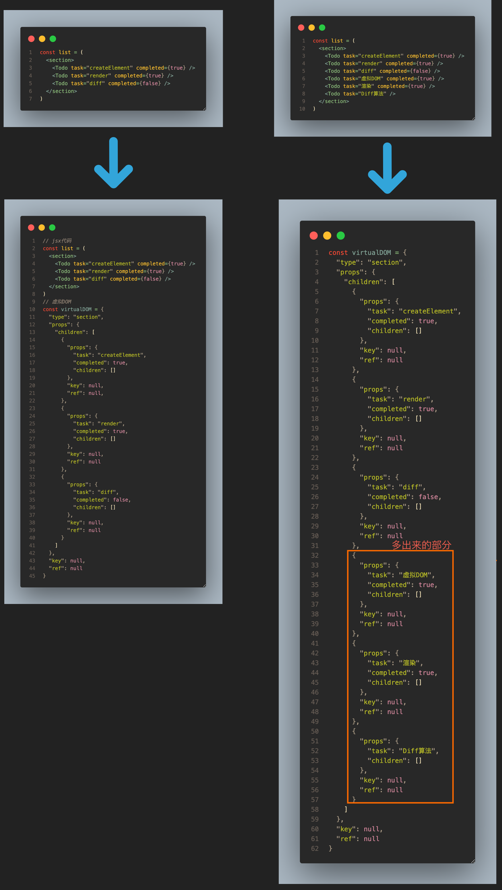
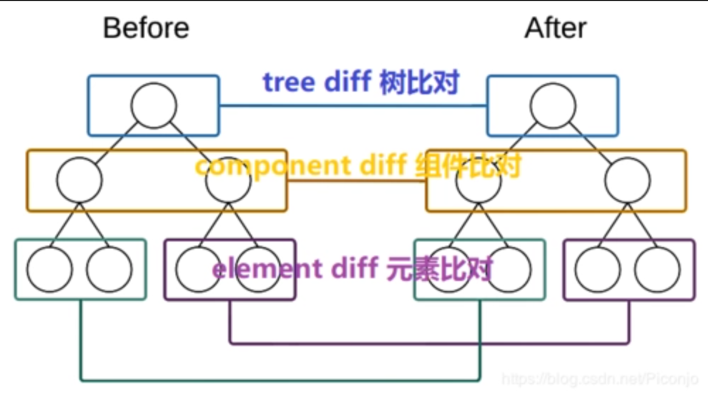

# 用TypeScript手摸手造一个React轮子(Diff篇上)

> 本篇文章是《用TypeScript手摸手造一个React轮子》的第三篇. 我们来讲讲Diff算法的简单实现. 项目的源代码在[这里](https://github.com/winoooops/my-react), 欢迎大家多多star和fork🥺🥺🥺. 

<!-- vscode-markdown-toc -->
* 1. [何谓Diff算法(props)](#Diffprops)
* 2. [ Diff算法的关键](#Diff)
	* 2.1. [关键: 是否是第一次渲染](#:)
	* 2.2. [关键: 获取上一次渲染的虚拟DOM](#:DOM)
	* 2.3. [关键: 渲染组件还是DOM元素?](#:DOM-1)
* 3. [ 更新DOM元素](#DOM)
	* 3.1. [更新文本节点](#)
	* 3.2. [更新props属性(深度比较)](#props)
	* 3.3. [递归循环更新子元素](#-1)
	* 3.4. [判断旧虚拟DOM上的属性是否被删除](#DOM-1)
* 4. [ 更新组件](#-1)
	* 4.1. [组件的更新 === 类式组件的更新](#-1)
	* 4.2. [判断是否为同一个组件](#-1)
	* 4.3. [完成组件的Diff算法](#Diff-1)
* 5. [测试和Demo](#Demo)
	* 5.1. [Demo](#Demo-1)
	* 5.2. [测试](#-1)

<!-- vscode-markdown-toc-config
	numbering=true
	autoSave=true
	/vscode-markdown-toc-config -->
<!-- /vscode-markdown-toc -->


##  1. <a name='Diffprops'></a>何谓Diff算法(props)

> 因为现在我们还没有引入state的概念，所以本小节的diff算法仅局限于给定元素props的更新!

就像之前提到过的那样, React之所以要使用虚拟DOM, 就是为了最大程度上减少直接对DOM进行操作. 依照我们此前的逻辑, 每一次一个虚拟DOM被渲染的时候, MyReact引擎都会遍历递归当前的虚拟DOM树来完成渲染. 但在实际应用场景下, 有些时候我们只是修改了组件下面的一个样式信息, 如果不管三七二十一地对这个组件进行重复渲染, 会浪费不少资源影响用户体验. 所以我们就需要某种机制, 去*判断出发生改动的最小组件*. 这个机制, 就是React的Diff算法. 直接利用上一篇[组件渲染]()中的例子来看:



在这个例子中, 因为我们只是在原有的list的基础上添加了新的子元素, 所以最优的情况就是在原有的基础上多渲染出这三个子元素即可. 这其中的关键就是1) 对比不同虚拟DOM树下同级别的虚拟DOM 2) 更新这个虚拟DOM所对应的DOM对象. 我们来看这张经典的对比虚拟DOM的图



在之前的几个章节中，我们有用到__virtualDOM这个属性，目的就是为了当改变发生的时候，我们可以利用__virtualDOM这个属性和当前的虚拟DOM去做比较，以此来做到同级别的比较. 同级比较的好处就是我们只需要遍历一次虚拟DOM树(比较当前的虚拟DOM和容器的__virtualDOM即可), 所以此时的时间复杂度是`O(n)`, 其中的n就是这颗虚拟DOM树下全部节点的数量. 

```ts
export const mountComponent = (virtualDOM: MyReactElement, container: HTMLElement) => {
  // 获取构造函数和属性
  /* ... */
  // 如果是类组件
  /* ... */ 
  // 如果是函数组件 
  /* ... */
  // 记录下虚拟DOM方便diff算法比较
  container.__virtualDOM = newVirtualDOM
  // 判断渲染出来的元素类型, 以此来决定递归渲染的类型
  /* ... */
}
```


总结: 在引入*Fiber*之前，React的Diff算法“高效”的关键就在于，借助虚拟DOM Tree，它能够实现最小颗粒度的更新——当某个组件或者元素的prop或者state发生改变时，React会用同级比较的方式比较新旧两个虚拟DOM树，找到发生这个改变的最小树节点并渲染这个差异.

所以我们有必要对原来的渲染进行扩充和修改：

* 如果是第一次渲染，不需要比较，直接渲染
* 如果不是第一次渲染，读取父容器中__virtualDOM的值（之前的虚拟DOM）
  * 如果是组件
    * 读取之前的组件__virtualDOM.component
    * 如果为同一个组件，判断是否需要重新渲染
    * 如果不是同一个组件，直接渲染
  * 如果是DOM节点
    * 如果是文本，比较props.textContent
    * 如果是DOM元素，深度比较新旧虚拟DOM中的props对象
  * 如果含有子元素，递归遍历全部子元素

以上这些判断，大致上就是React的Diff算法所做的.先有的render函数就本身已经不能满足需求了, 我们需要借助Diff算法来实现高效更新页面的功能.

##  2. <a name='Diff'></a> Diff算法的关键
###  2.1. <a name=':'></a>关键: 是否是第一次渲染

Diff算法的第一个关键就是判断某个虚拟DOM是不是第一次渲染, 我们所需要做的就是--判断`MyReact.render(App, root)`这里的`root`是否含有子元素.  

> 知道为什么React在渲染组件的时候要求我们只能把jsx包裹在一个标签中吗？因为这个规范可以让React很方便地通过Node.firstChild来判断某个虚拟DOM是否被渲染过.

因为我们现在并不是直接渲染虚拟DOM, 而是首先用Diff算法去判断这个容器已经渲染过虚拟DOM, 所以我们需要把`render`函数改写成下面这样:

```ts
/**
 * 借助Diff实现渲染
 * @param virtualDOM 
 * @param container 
 */
export const render = (virtualDOM: MyReactElement, container: MyHTMLElement) => {
  diff(virtualDOM, container, container?.firstChild as MyHTMLElement)
}

/**
 * Diff算法
 * @param virtualDOM 
 * @param element 
 * @param preVirtualDOM 
 */
export const diff = (virtualDOM: MyReactElement, container: MyHTMLElement, element: MyHTMLElement) => {
  // 如果element不存在,意味着这是第一次渲染, 不需要比较, 直接渲染就好
  if (!element) return mountElement(virtualDOM, container)
  // TODO 获取之前的虚拟DOM
  /* ... */
}

```
###  2.2. <a name=':DOM'></a>关键: 获取上一次渲染的虚拟DOM

既然我们之前在虚拟DOM首次渲染的时候, 通过`__virtualDOM`存储了虚拟DOM, 那么在更新的时候获取之前的虚拟DOM也只需要去读取`__virtualDOM`这个值就可以了.

```ts
/* ./src/MyReact/MyReactRender.ts */

export const diff = (virtualDOM: MyReactElement, container: MyHTMLElement, element: MyHTMLElement) => {
  // 如果element不存在,意味着这是第一次渲染, 不需要比较直接渲染就好
  if (!element) return mountElement(virtualDOM, container)
  // 获取之前的虚拟DOM
  const oldVirtualDOM = element.__virtualDOM
  const { type, props } = virtualDOM
  // 判断是组件还是DOM节点 
}
```
###  2.3. <a name=':DOM-1'></a>关键: 渲染组件还是DOM元素?

判断虚拟DOM是组件还是DOM元素参照上一篇组件渲染的话可以很简单滴实现:
```ts
export const diff = (virtualDOM: MyReactElement, container: MyHTMLElement, element: MyHTMLElement) => {
  // 如果element不存在,意味着这是第一次渲染, 不需要比较直接渲染就好
  if (!element) return mountElement(virtualDOM, container)
  // 获取之前的虚拟DOM
  const oldVirtualDOM = element.__virtualDOM
  const { type, props } = virtualDOM
  // 判断是组件还是DOM节点 
  if (isFunction(type)) {
    // 更新组件
  } else {
    // 更新DOM
  }
 
}
```
##  3. <a name='DOM'></a> 更新DOM元素

更新DOM元素时我们需要做到:

* 如果是文本节点, 直接更换文本
* 比较新的虚拟DOM上props的属性和旧的虚拟DOM上props的差异
* DOM元素如果有子元素, 循环遍历
* 判断旧虚拟DOM上的属性是否被删除
* 记录下新的虚拟DOM

###  3.1. <a name=''></a>更新文本节点
如果是比较文本节点的话, 我们可以很轻松地完成:
```ts
/**
 * 更新DOM文本节点
 * @param virtualDOM 
 * @param oldVirtualDOM 
 * @param element 
 */
export const updateText = (virtualDOM: MyReactElement, oldVirtualDOM: MyReactElement, element: MyHTMLElement) => {
  if (virtualDOM.props.textContent !== oldVirtualDOM.props.textContent) {
    // 更换文本
    element.textContent = virtualDOM.props.textContent
    // 储存为__virtualDOM
    element.__virtualDOM = virtualDOM
  }
}
```

###  3.2. <a name='props'></a>更新props属性(深度比较)
如果是DOM元素节点的话, 首先我们需要从diff方法中传递三个形参数过来——`virtualDOM`, `oldVirtualDOM`这两个就不多说了,比较的话肯定是需要的; 第三个参数是`element`, 因为我们需要知道这个更新发生的位置;
```ts
/* ./src/MyReact/MyReactDOM.ts */

/**
 * 更新DOM元素  => 更新元素下面的属性值
 * @param virtualDOM 
 * @param oldVirtualDOM 
 * @param element 
 */
export const updateDOMElement = (virtualDOM: MyReactElement, oldVirtualDOM: MyReactElement, element: MyHTMLElement) => {}
```

下一步就是比较props的区别了. 这里需要考虑到props中的某个属性有可能是对象,数组,方法(本质上也是对象)这样的引用值,那么我们在比较的时候就需要考虑到需要深度比较的情况. 这里我们直接使用**lodash**的`isEqual`方法, 不过造轮子的乐趣不就在于能自己实现的统统自己实现嘛? 所以我们来自己实现深度看看:

```ts
/* ./src/shard/utils.ts */

export const isEqual = <T>(firstObj: T, secondObj: T): boolean => {
  // 1. 如果不是复杂类型，直接判断
  if (!isReference(firstObj) || !isReference(secondObj)) return firstObj === secondObj

  // 2. 比较是否引用同一个内存地址
  if (firstObj === secondObj) return true

  // 3. 如果都是对象或者数组的话开始深度比较
  const firstKeys = Object.keys(firstObj)
  const secondKeys = Object.keys(secondObj)
  // 3.1 如果长度不相等 
  if (firstKeys.length !== secondKeys.length) return false
  // 3.2 递归判断 
  for (let key in firstObj) {
    const result = isEqual(firstObj[key], secondObj[key])
    if (!result) return false
  }
  return true
}

/* 判断某个值是否是复杂类型 */
export const isReference = <T>(value: T): boolean => {
  return value && typeof value === 'object'
}
```
借助深度比较, 我们就可以遍历比较新的虚拟DOM上的属性和旧的虚拟DOM上的不同
```ts
export const updateDOMElement = (virtualDOM: MyReactElement, oldVirtualDOM: MyReactElement, element: MyHTMLElement) => {
  const newProps = virtualDOM.props
  const oldProps = oldVirtualDOM.props
  const propsKeys = Object.keys(newProps)
  const oldPropsKeys = Object.keys(oldProps)
  // 从新的比旧的
  propsKeys.length && propsKeys.forEach((key: string) => {
    if(key === 'textContent') { 
      updateText(virtualDOM, oldVirtualDOM, element)
    }
    else if (key === 'children' ) {
      // 如果有子元素, 需要递归Diff
    }
    else {
      // 如果属性值发生改变
      if (!isEqual(newProps[key], oldProps[key])) {
        console.log(newProps[key])
        console.log(oldProps[key])
        updateProp(key, newProps[key], element) // 更新某个DOM节点上特定的属性值
        console.log(`---------${key} has been updated---------`)
      }
    }
  })
  // 从旧的比新的

  // 记录新的虚拟DOM
  element.__virtualDOM = virtualDOM
}
```
###  3.3. <a name='-1'></a>递归循环更新子元素
和首次渲染DOM元素类似, 我们需要首先判断处虚拟DOM需要渲染出的虚拟DOM(`newVirtualDOM`)是组件还是DOM元素:
  * 如果newVirtualDOM依然为组件, 则递归更新 
  * 如果newVirtualDOM为DOM元素
    * 如果含有子元素, 递归执行Diff算法
    * 遍历更新props属性

针对newVirtualDOM为DOM元素的情况, 需要说明两点: 

**第一点**: 如果虚拟DOM元素需要渲染一个DOM元素, 并且这个DOM元素下面有3个子元素. 根据我们在`createElement`这个方法中定义的规则, 那么这三个子元素的虚拟DOM会被保存在`props.children`中; 并且这些子元素的虚拟DOM下的`type`属性(也就是子元素所需要渲染出来的虚拟DOM)有可能是函数(渲染组件)也有可能是字符串(渲染DOM元素). 所以我们需要去递归遍历`props.children`中的虚拟DOM并执行*Diff算法*.

```ts

/* MyReact/MyReactDOM.ts */

/**
 * 更新子元素 
 * @param virtualDOM 
 * @param oldVirtualDOM 
 * @param element 
 */
export const updateChildren = (virtualDOM: MyReactElement, oldVirtualDOM: MyReactElement, element: MyHTMLElement) => {
  const { children } = virtualDOM.props
  console.log(children);
  const { children: oldChildren } = oldVirtualDOM.props
  console.log(oldChildren);
  // 如果有子元素
  // Todo 应该用key来查找, 现在先用index查找
  children?.forEach((newElement: MyReactElement, index: number) => {
    console.log(index);
    console.log(newElement);
    console.log('oldElement: ', oldChildren[index]);
    const oldElement = oldChildren[index]
    // 如果不存在, 直接添加
    if (!oldElement) {
      mountElement(newElement, element)
    }
    // 如果存在, 递归Diff
    else {
      diff(newElement, element, element.childNodes[index] as MyHTMLElement)
    }
  });
}
```


**第二点**: 既然我们需要去递归遍历`props.children`中的虚拟DOM并执行Diff算法, 我们就需要知道旧虚拟DOM中的组件实例; 可是**存储组件实例是在实际渲染的时候才执行的**, 换句话说, 给定一个组件的前后两个虚拟DOM: `newChildVDOM`和`oldChildVDOM`, 如果我们此时去执行`diff(newChildVDOM, container, element, oldChildVDOM)`的话, `oldChildVDOM`下面是没有`component`这个属性的. 这会造成在*Diff*比较的时候*MyReact*引擎认为这两个组件并不是同一个组件, 直接重复渲染了. 所以我们需要修改一下`updateProp`这个方法: 
```ts
/* MyReact/MyReactDOM.ts */

export const updateProp = (propName: string, propValue: any, element: MyHTMLElement) => {
  // 如果是children 跳过
  if (propName === 'children') {
    // 原先的逻辑 => 直接跳过
    // return 

    // 现在改成 => 如果遍历的虚拟DOM是组件的话, 需要记录下负责渲染虚拟DOM的component是什么
    propValue.map((child: MyReactElement) => {
      const { type: C, props } = child
      // 如果为组件, 需要给children里面的元素增加上component这个属性, 方便Diff算法比较
      if (isFunction(C)) {
        if (isClassComponent(child.type)) {
          return Object.assign(child, { component: new C(props || {}) })
        } else {
          return Object.assign(child, { component: C(props || {}) })
        }
      }
      // 如果为DOM元素 
      else {
        return child
      }
    })
  }
  /* 其他省略 */
}

```


###  3.4. <a name='DOM-1'></a>判断旧虚拟DOM上的属性是否被删除

比较完了新虚拟DOM的props属性上的改变,我们还需要检查原先的虚拟DOM是否已经在新的虚拟DOM上被删除了. 如果答案是肯定的话, 我们就需要把它从DOM节点上删掉.
```ts
export const updateDOMElement = (virtualDOM: MyReactElement, oldVirtualDOM: MyReactElement, element: MyHTMLElement) => {
  const newProps = virtualDOM.props
  const oldProps = oldVirtualDOM.props
  const propsKeys = Object.keys(newProps)
  const oldPropsKeys = Object.keys(oldProps)

  /* 从新的比旧的, 省略 */ 

  // 从旧的比新的
  oldPropsKeys.length && oldPropsKeys.forEach((oldKey: string) => {
    // 如果属性被删除
    if (!propsKeys.includes(oldKey)) {
      removeProp(oldKey, oldProps[oldKey], element)
    }
  })
  // 记录新的虚拟DOM
  element.__virtualDOM = virtualDOM
}

/**
 * 删除属性 
 * @param propName 
 * @param propValue 
 * @param element 
 */
export const removeProp = (propName: string, propValue: any, element: MyHTMLElement) => {
  if (propName === 'children') return
  if (propName.toLowerCase().slice(0, 2) === 'on') {
    element.removeEventListener(propName.toLowerCase().slice(2), propValue)
  } else {
    element.removeAttribute(propName)
  }
}
```

**总结**
* 在更新DOM元素的时候,我们需要考虑三种情况:
  1. 更新文字
  2. 递归更新子元素
  3. 更新其他属性
* 更新完DOM元素之后,还需要考虑是否有元素被删除
* 最后才是记录下新的虚拟DOM

```ts
export const updateDOMElement = (virtualDOM: MyReactElement, oldVirtualDOM: MyReactElement, element: MyHTMLElement) => {
  const newProps = virtualDOM.props
  const oldProps = oldVirtualDOM.props
  const propsKeys = Object.keys(newProps)
  const oldPropsKeys = Object.keys(oldProps)
  // 从新的比旧的
  propsKeys.length && propsKeys.forEach((key: string) => {
    if(key === 'textContent') { 
      updateText(virtualDOM, oldVirtualDOM, element)
    }
    else if (key === 'children' ) {
      // 如果有子元素, 需要递归Diff
      updateChildren(virtualDOM, oldVirtualDOM, element)
    }
    else {
      // 如果属性值发生改变
      if (!isEqual(newProps[key], oldProps[key])) {
        updateProp(key, newProps[key], element) // 更新某个DOM节点上特定的属性值
      }
    }
  })
  // 从旧的比新的
  oldPropsKeys.length && oldPropsKeys.forEach((oldKey: string) => {
    // 如果属性被删除
    if (!propsKeys.includes(oldKey)) {
      removeProp(oldKey, oldProps[oldKey], element)
    }
  }) 
  // 记录新的虚拟DOM
  element.__virtualDOM = virtualDOM
}
```

完成了DOM元素的更新, 此时的*Diff方法*就是这样的:
```ts
export const diff = (virtualDOM: MyReactElement, container: MyHTMLElement, element: MyHTMLElement) => {
  // 如果element不存在,意味着这是第一次渲染, 不需要比较, 直接渲染就好
  if (!element) return mountElement(virtualDOM, container)
  // 获取之前的虚拟DOM
  const oldVirtualDOM = element.__virtualDOM
  const { type, props } = virtualDOM
  // 判断是组件还是DOM节点 
  if (isFunction(type)) {
    // 更新组件
    // do something 
  } else {
    // 更新DOM
    updateDOMElement(virtualDOM, oldVirtualDOM, element)
  }
}
```
##  4. <a name='-1'></a> 更新组件

###  4.1. <a name='-1'></a>组件的更新 === 类式组件的更新
因为函数式组件无状态的特性, 不管它的props更新与否, 每次其父组件更新的时候React都会将它重新渲染一遍. 
> 所以React在16.6版本中引入了memo概念, 引入它的本意是为了避免不必要的重复渲染(仅限于props). 可以阅读[Stackflow上的这个帖子](https://stackoverflow.com/questions/40909902/shouldcomponentupdate-in-function-components) 或者官方的 [React.memo](https://zh-hans.reactjs.org/docs/react-api.html#reactmemo) 了解更多. 

**鉴于这个原因, “组件的更新”这个概念, 更准确地说, 应该是类式组件的更新.**

更新组件的时候我们需要知道:

1. 这个新的虚拟DOM和旧的虚拟DOM是否是同一个组件; 
2. 是否需要对这个虚拟DOM进行更新. 简单的伪代码就是下面这样的:

* a. 如果虚拟DOM和旧虚拟DOM渲染的是同一个组件
  * i. 如果props发生了更新, 更新组件
  * ii. 如果props没有更新, 返回
* b. 如果虚拟DOM和旧虚拟DOM渲染的不是同一个组件, 直接渲染新组件


###  4.2. <a name='-1'></a>判断是否为同一个组件
所以这里需要实现的首先就是如何判断两个虚拟DOM渲染的是同一个组件. 对于组件来说, 如果我们直接组件对`virtualDOM.type`和其父元素节点的`__virualDOM.type`属性进行比较的话, 结果永远都是`false`. 因为在组件`mountComponent`中第一次渲染时, `container.__virtualDOM = newVirtualDOM` 中的`__virtualDOM`其实已经是组件render(类组件)或者return(函数式组件)返回的虚拟DOM了. 
 
```ts
/* ./demo/index.tsx */
// 重新渲染同一个组件 

class Todos extends React.Component<{ type: string }>{
  render() {
    const { type } = this.props
    return type === 'one' ? vDOM : vDOM2
  }
} 

const root = document.getElementById('app') as MyHTMLElement
MyReact.render(<Todos type="one" />, root)

setTimeout(() => {
  MyReact.render(<Todos type="two" />, root)
}, 5000);
export const diff = (virtualDOM: MyReactElement, container: MyHTMLElement, element: MyHTMLElement) => {
  // * 第一次渲染
  if (!element) return mountElement(virtualDOM, container)
  // * 同级别比较
  // 获取之前的虚拟DOM
  const oldVirtualDOM = element.__virtualDOM

  console.log(oldVirtualDOM.type) // "div"
  console.log(virtualDOM.type) // f Todos() {/*...*/}
  console.log(virtualDOM.type === oldVirtualDOM.type) // false

  /* 以下省略 */
}

```
对比两个虚拟DOM的时候, 用直接比较渲染出来的结果的来判断他们是不是同一个组件的做法肯定是不够优雅的.

**推荐做法**: 这里我们可以利用构造器`constructor`的原理--在第一次渲染的时候k, 储存下组件的实例`__virtualDOM.component`. *Diff*的时候只需要比较`virutalDOM.type`是否是`__virtualDOM.component`的构造器即可.
```ts
// 存储负责渲染虚拟DOM的组件
/* .src/MyReact/MyReactComponent.ts */

// 修改mountComponent方法: 在第一次渲染的时候, 把实例储存在__virtualDOM中
const mountComponent = () => {
  /* ... */
  // 如果是类组件
  if (isClassComponent(virtualDOM.type)) {
    console.log('rendering class component')
    // 创建实例并返回
    component = new C(props || {})
    newVirtualDOM = component.render()
    // !!新增: 记录下component方便diff算法比较
    newVirtualDOM.component = component
  }
  // 如果是函数组件 
  else {
    console.log('rendering functional component')
    newVirtualDOM = C(props || {})
    // 函数式组件不需要记录, 因为没吃更新都需要重新渲染
  }
}

/* src/shared/utils.ts */
/**
 * 判断组件是否为同一个 
 * @param virtualDOM 
 * @param oldComponent 
 * @returns 
 */
export const isSameComponent = (virtualDOM: MyReactElement, oldComponent: any) => {
  return oldComponent && virtualDOM.type === oldComponent.constructor
}

```
目前我们的组件更新逻辑: 在组件更新的时候, 如果同一个组件就执行diff算法更新组件; 如果不是同一个组件的话(包括函数式组件), 就直接把原来的`__virtualDOM`元素从父容器中删除, 然后重新渲染组件.

```ts
/**
 * 更新组件
 * @param virtualDOM 
 * @param oldComponent 
 * @param element 
 * @param container 
 */
export const updateComponent = (virtualDOM: MyReactElement, oldComponent: MyReactComponent, element: MyHTMLElement, container: MyHTMLElement) => {
  // 如果不是同一个组件，直接渲染
  if (!isSameComponent(virtualDOM, oldComponent)) {
    // 判断是否需要重新渲染
    container.removeChild(element)
    mountComponent(virualDOM, element)
  }
  // 如果是同一个组件，更新
  else {
    // 判断组件的props是否进行了改变  
  }
}

```
下一步我们就可以去判断组件下面的props是否进行了改变, 在这里加上可以加上生命周期函数的概念.

> 因为TS和babel规则的关系, 例子中的component是直接继承的React.Component, 所以我在仿照声明钩子的时候, 是直接用的函数而不是类下面的方法. 现在先暂时用这个方案.
```ts
/* ./src/MyReact/MyReactLifecycle.ts */
// 只涉及props的比较, 借助深度比较实现  
export const shouldComponentUpdate = (prevProps: { [key: string]: any }, props: { [key: string]: any }) => {
  return !isEqual(prevProps, props)
}

```


###  4.3. <a name='Diff-1'></a>完成组件的Diff算法
如此一来, 我们凑齐了props改变触发Diff更新组件方法的全部零件, 把它们拼到一起试试!
```ts
/**
 * 更新组件
 * @param virtualDOM 
 * @param oldComponent 
 * @param element 
 * @param container 
 */
export const updateComponent = (virtualDOM: MyReactElement, oldVirtualDOM: MyReactElement, element: MyHTMLElement, container: MyHTMLElement) => {
  // 获取旧虚拟DOM的组件实例
  const oldComponent = oldVirtualDOM.component
  if (!oldComponent || !isSameComponent(virtualDOM, oldComponent)) {
    console.log('is not the same component, start rendering')
    container.removeChild(element)
    mountComponent(virtualDOM, container)
  }

  // 如果是同一个组件，更新
  else {
    // 判断是否需要重新渲染
    if (!shouldComponentUpdate(oldComponent.props, virtualDOM.props)) return
  
    // 更新的时候需要循环遍历下面的子组件
    const { type: C, props } = virtualDOM
    const newVirtualDOM = new C(props || {}).render()
    // 如果依然为组件
    if (isFunction(newVirtualDOM.type)) {
      // diff(newVirtualDOM, )
      updateComponent(newVirtualDOM, oldVirtualDOM, element, container)
    }
    // DOM元素
    else {
      // 更新props
      updateDOMElement(newVirtualDOM, oldVirtualDOM, element) 
    }
  }
}
```

##  5. <a name='Demo'></a>测试和Demo

###  5.1. <a name='Demo-1'></a>Demo

在上一节组件渲染篇中, 我们把Todos组件定义成函数式组件, 为了测试函数式组件的渲染; 而函数式组件在更新的时候是直接渲染的, 所以我们需要把它改成类式组件来测试Diff算法. 

```ts
export class Todo extends React.Component<{ task: string, completed?: boolean, event?: MouseEventHandler<HTMLLIElement> }> {
  render() {
    const { completed, task, event } = this.props
    return (
      <li className={completed ? 'completed' : 'ongoing'} onClick={event}>
        {task}
      </li>
    )
  }
}
// 把Todos也改成类式组件
export class Todos extends React.Component<{ type: string }> {
  render() {
    const { type } = this.props
    const engList = (
      <section className="todos eng" role="list">
        <Todo task="createElement" completed={true} />
        <Todo task="render" completed={true} />
        <Todo task="diff" completed={false} />
      </section>
    )
    const cnList = (
      <section className="todos chi" role="list">
        <Todo task="createElement" completed={true} />
        <Todo task="render" completed={true} />
        <Todo task="Diff" completed={true} />
        <Todo task="虚拟DOM" completed={true} />
        <Todo task="渲染" completed={true} />
        <Todo task="Diff算法" />
      </section>
    )
    return type === 'one' ? engList : cnList
  }
}


const root = document.getElementById('app') as MyHTMLElement
MyReact.render(<Todos type="one" />, root)

// 5秒后更新组件
setTimeout(() => {
  MyReact.render(<Todos type="two" />, root)
}, 5000);
```

在这个Demo中,我们可以发现Todos列表的发生了以下5处变化:
1) 第三项`task`为'diff'的组件: `completed`的状态从`false`变成了`true`
2) 第三项`task`为'diff'的组件: `task`从‘diff’变成了‘Diff’ 
3-5) 添加了`task`为‘虚拟DOM’,‘渲染’和‘Diff算法’这三个`Todo`子组件

从控制台中打印出来的信息显示来看, 对于task为diff的这个Todo组件, MyReact先是判断出了新旧两个组件为同一个实力例渲染出来的, 并且它需要被更新; 对于新增的三个组件来说, 因为oldComponent不存在, 所以可以直接渲染. 


###  5.2. <a name='-1'></a>测试

和之前一样, 我们也可用通过jest去测试Diff算法里的这些方法是否正确. 首先需要保证现有的代码能够通过之前的渲染的测试用例:


这里的测试用例就DOM元素更新和组件更新进行了一些简单的测试, 这里测试的内容主要是

* DOM元素Diff时能够更改文字
* DOM元素Diff能够更新DOM元素的属性性(以样式为例)
* DOM元素Diff时能够正确更改子元素的数量
* 组件Diff更新props属性并正确渲染DOM元素
* 组件Diff正确更新子组件并渲染

```ts
/*************************
 * __tests__/diff.test.tsx
*************************/

describe("test Diff with DOM", () => {
  it('should update text', () => {
    let oldVirtualDOM = <p>old</p>
    let newVirtualDOM = <p>new</p>
    mountDOMElement(oldVirtualDOM, container)
    setTimeout(() => {
      updateDOMElement(newVirtualDOM, oldVirtualDOM, container)
      expect(getByText(container, 'new')).toBeTruthy()
    }, 3000);
  })

  it('should update class', () => {
    let oldVirtualDOM = <p className="cool">old</p>
    let newVirtualDOM = <p className="chill">new</p>
    mountDOMElement(oldVirtualDOM, container)
    setTimeout(() => {
      updateDOMElement(newVirtualDOM, oldVirtualDOM, container)
      expect(getByText(container, 'new')).toHaveClass('chill')
    }, 3000);
  })

  it('should have correect child elements', () => {
    let oldVDOM = (
      <ul role="list">
        <li>a</li>
        <li>b</li>
        <li>c</li>
      </ul>
    )
    let newVDOM = (
      <ul role="list">
        <li>a</li>
        <li>b</li>
        <li>c</li>
        <li>d</li>
        <li>Z</li>
      </ul>
    )

    mountDOMElement(oldVDOM, container)
    expect(getByRole(container, 'list').childElementCount).toBe(3)
    setTimeout(() => {
      updateDOMElement(newVDOM, oldVDOM, container)
      expect(getByRole(container, 'list').childElementCount).toBe(5)
    }, 3000);
  })
})

describe('test Diff with Component', () => {
  it('should update props', () => {
    let oldVDOM = <Todo task="diff" completed={false} />
    let newVDOM = <Todo task="Diff" completed={true} />
    mountComponent(oldVDOM, container)
    setTimeout(() => {
      updateComponent(newVDOM, oldVDOM, container.firstChild, container)
      expect(getByText(container, 'Diff')).toBeTruthy()
      expect(getByText(container, 'Diff').parentElement).toHaveClass('completed')
    }, 3000);
  })

  it('should update child elements', () => {
    let oldVDOM = <Todos type="one" />
    let newVDOM = <Todos type="two" />

    mountComponent(oldVDOM, container)
    expect(getByRole(container, 'list').childElementCount).toBe(3)
    setTimeout(() => {
      updateComponent(newVDOM, oldVDOM, container.firstChild, container)
      expect(getByRole(container, 'list').childElementCount).toBe(6)
      expect(getByRole(container, 'list').childNodes[2]).toHaveTextContent('Diff')
      expect(getByRole(container, 'list').childNodes[2]).toHaveClass('completed')
    }, 3000);
  })

})
```
不出意外的话, 测试案例是可以通过的. 因为时间所限我就不多做测试案例了, 欢迎大家自己去测试几个极端情况看看.


以上, 我们完成了React轮子Diff算法的基础部分, 实现了MyReact引擎利用深度优先算法, 来较为搞笑地更新虚拟DOM. 

祝大家虎年春节愉快, 我们节后再见.