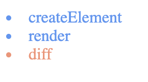
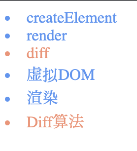

# 用TypeScript手摸手造一个React轮子(组件渲染篇)

> 本篇文章是在阅读[小村儿](https://juejin.cn/user/1310273589219623/posts)大佬的react学习系列之后自己的实践和补充, 正好最近也想通过用Typescript造轮子的过程加深对TS和类型思想的理解, 毕竟React对TS的支持度还是很高的(点名批评Vue). 理解源码最好的方式可能就是自己造一个. 这里大部分是我对编码思路的一些整理, 希望也能对你有所帮助. 如果有哪里不对或者不准确的地方, 也希望你能够毫不吝啬地指出来🥺

## 目录
- [1. 组件渲染的逻辑](1.&nbsp;组件渲染的逻辑)
- [2. 区分组件和DOM元素](2.&nbsp;区分组件和DOM元素)
- [3. 判断函数式组件和类组件](3.&nbsp;判断函数式组件和类组件)
- [4. 渲染组件](4.&nbsp;渲染组件)
- [5. 测试](5.&nbsp;测试)


## 1. 组件渲染的逻辑
我们在之前实现了渲染原生DOM元素, 下一步就来操作下组件的渲染吧! 在jsx和tsx中，组件在被使用的时候都会以`<Greeting />`这样的形式出现，并且组件分为函数式组件和类式组件. 所以必须先对组件的类型做判断.结合上上一节的DOM元素渲染，render函数现在伪代码应该是:
1. 如果是DOM元素，执行mountDOMElement方法
2. 如果是组件，判断组件的类型
    * 渲染函数式组件
    * 渲染类式组件
    * 判断渲染出来的虚拟DOM类型
      * 如果为组件, 递归渲染
      * 如果为DOM元素, 递归渲染
## 2. 区分组件和DOM元素
第一步我们要解决的就是如何判断某个虚拟DOM是组件，先来看看组件在被creatElement编译过后长的啥样: 

分别定义函数式组件`Greeting`和类组件`Welcome`, 然后用console.log打印到控制台里.
> 这里我在定义类组件的时候直接继承的`React.Component`, 先埋个坑, 以后在实现生命周期或者实现Fiber的时候补上...

```tsx
const Greeting = function () {
  return (
    <div>
      <h1>Hello React</h1>
    </div>
  )
}

class Welcome extends React.Component {
  render() {
    return (
      <div>
        <h1>Hello React</h1>
      </div>
    )
  }
}

console.log(<Greeting />);
console.log(<Welcome />)
```
下图打印出来的结果,是通过我们之前写的`createElement`方法实现的———不管是函数式组件还是类组件，在被`console.log`打印出来的时候会是下图这样的.可以发现，Welcome组件的虚拟DOM(右图)，它的type(`Welcome()`)这里和原生DOM元素的`"div"`这样的(左图)不同，是函数来的.

<div style="display: flex;">


</div>
<br/>

那么我们可以其`type`属性是否为函数这一点来判断某个虚拟DOM是否为组件.
```ts
/* shared/utils.ts */
/**
 * 利用组件虚拟DOM的type属性为function这个特点，判断指定的虚拟DOM应该被渲染成组件还是渲染成原生DOM节点 
 * @param type 
 * @returns boolean
 */
export const isFunction = <T>(type: T): boolean => {
  return type && type instanceof Function
}


/* demo/index.tsx */
console.log(isFunction(vDOM)); // false 
console.log(isFunction(Greeting.type)); // 报错, Property 'type' does not exist on type '() => Element'.
console.log(isFunction(Welcome.type)); // 报错, Property 'type' does not exist on type 'typeof Welcome'.
```
> 这里有个问题, 如果我们直接去判断`Greeting`这个函数和`Welcome`这个类的type是否为函数时, TS会报错——因为在他们在此时都只是单纯的tsx代码, 并没有被createElement方法编译成虚拟DOM; 而type属性是存在于虚拟DOM上的;  
> ```ts
> const greeting = Greeting() // 
> const welcome = new Welcome({}).render()
>
> // console.log(isFunction(Greeting.type)) ❌
> console.log(isFunction(greeting.type)) //️ true
>
> // console.log(isFunction(Welcome.type)) ❌
> console.log(isFunction(welcome.type)) // true
> ```
## 3. 判断函数式组件和类组件
如果我们细看组件中的这个type属性，可以发现Welcome和Greeting返回的这个`type`函数是有区别的:


如果尝试打印出这两者的protype的话，就会是这样的:


`Welcome`继承的是`React.Component`这个父类，我在阅读[React是如何区分Class和Function](https://zhuanlan.zhihu.com/p/51705609)这篇文章时候了解到——官方使用在Component里加上了`isReactComponent`这个属性, 用来实现类组件和函数式组件的区分：
```js
// React 内部
class Component {}
Component.isReactClass = {};

// 我们可以像这样检查它
class Welcome extends React.Component {}
console.log(Welcome.isReactClass); // {}
```
于是我就可以使用下面这个方法来区别函数式样组件和类组件：
```ts
/* src/shared/utils.ts */

export const isFunction = () => { /* ... */ }

/**
 * 可以利用类组件的实例的原型上有isReactComponent这个属性来判断是函数式组件还是类式组件 
 * @param type 
 * @returns 
 */
export const isClassComponent = <T extends Function>(type: T): boolean => {
  return type && !!type.prototype.isReactComponent
}

```

## 4. 渲染组件

现在, 借助`isFunction`和`isClassComponent`这两个方法，就可以实现之前提到的这个逻辑:
1. 如果是DOM元素，执行`mountDOMElement`方法
2. 如果是组件，执行`mountComponent`, 判断组件的类型
    * 渲染函数式组件
    * 渲染类式组件
    * 判断渲染出来的虚拟DOM类型
      * 如果为组件, 递归执行`mountComponent`
      * 如果为DOM元素, 递归执行`mountDOMElement`

<div style="display:flex;">    
<div style="flex: 2 1 auto; margin-right:2em;">

```ts
export const mountComponent = (virtualDOM: MyReactElement, container: HTMLElement) => {
  // 获取构造函数和属性
  const { type: C, props } = virtualDOM
  let newVirtualDOM: MyReactElement
  // 如果是类组件
  if (isClassComponent(virtualDOM.type)) {
    console.log('rendering class component')
    // 创建实例并返回
    const c = new virtualDOM.type()
    newVirtualDOM = c.render(props || {} )
  }
  // 如果是函数组件 
  else {
    console.log('rendering functional component')
    newVirtualDOM = C(props || {})
  }

  // 记录下虚拟DOM方便diff算法比较
  container.__virtualDOM = newVirtualDOM

  // 判断newVirualDOM的类型是否为函数
  if (isFunction(newVirtualDOM.type)) {
    mountComponent(newVirtualDOM, container)
  } else {
    mountDOMElement(newVirtualDOM, container)
  }
}
```


</div>

<div class="width:20%;">

重点:

1. 函数式的组件: 在渲染的时候用`newVirtualDOM = C(props)`
2. 类式组件: 在渲染的时候用必须先创建*C*的实例*c*，然后才能使用`c.render(props)`
3. 在成功赋值给newVirtualDOM之后判断这个虚拟DOM的类型
    * 如果是组件，必须递归渲染`mountComponent`
    * 如果是DOM元素，递归执行`mountElement`方法

</div>
</div>

> 这里需要考虑到一个特殊情况: 当我们把组件包裹在原生DOM元素下, 例如下面这样的情况时
> ```ts
> const vDOM = (
>   <div>
>     <Todos>
>   </div>
> ) 
> ```
>
> 因为最外层是`<div>`, 所以会首先执行`mountDOMElement`这个方法, 但是上一节我们在这个方法里, 对于子元素只考虑到了渲染原生DOM这么一个场景. 为了适配子元素是组件的情况, 我们还需要对`mountDOMElement`这个方法做一些小小的改动: 
```ts
/* MyReact/MyReactDOM.ts */

/**
 * 渲染原生DOM元素
 * @param virtualDOM 虚拟DOM
 * @param container 父容器 
 */
export const mountDOMElement = (virtualDOM: MyReactElement, container: HTMLElement | null) => {
  /* 省略 */ 
  else {
    // 创建元素
    newElement = document.createElement(type)
    // 更新属性
    attachProps(virtualDOM, newElement)
    // 递归渲染子元素
    props?.children.forEach((child: MyReactElement) => {
      // mountDOMElement(child, newElement)
      mountElement(child, newElement) // 需要考虑到子元素是组件的情况
    })
  }
  //* 创建DOM元素的时候记录下当前的虚拟DOM
  newElement.__virtualDOM = virtualDOM
  container?.appendChild(newElement)
}
```
这个mountElement方法, 其实就是把之前判断虚拟DOM类型然后渲染的代码分离出来: 
```ts
/* MyReact/MyReactRender.ts */

/**
 * 渲染方法 
 * @param virtualDOM 
 * @param container 
 * @returns 
 */
export const mountElement = (virtualDOM: MyReactElement, container: MyHTMLElement) => {
  if (!container) return
  // 渲染组件还是渲染DOM元素
  if (isFunction(virtualDOM.type)) {
    // 渲染组件 
    mountComponent(virtualDOM, container)
  } else {
    // 渲染原生DOM元素
    console.log('Rendering DOM Element')
    mountDOMElement(virtualDOM, container)
  }
}
```
所以我们的`mountComponent`现在可以更精简的写成下面这样:
```ts
export const mountComponent = (virtualDOM: MyReactElement, container: HTMLElement) => {
  // 获取构造函数和属性
  const { type: C, props } = virtualDOM
  let newVirtualDOM: MyReactElement
  // 如果是类组件
  if (isClassComponent(virtualDOM.type)) {
    console.log('rendering class component')
    // 创建实例并返回
    const c = new virtualDOM.type()
    newVirtualDOM = c.render(props || {} )
  }
  // 如果是函数组件 
  else {
    console.log('rendering functional component')
    newVirtualDOM = C(props || {})
  }

  // 记录下虚拟DOM方便diff算法比较
  container.__virtualDOM = newVirtualDOM
  // 判断渲染出来的元素类型, 以此来决定递归渲染的类型
  mountElement(newVirtualDOM, container)
}

```


## 5. 测试
接下来我们可以测试下这套组件渲染逻辑在渲染多层组件的完成情况. 主要测试的有几点:

* Todo为类组件, 渲染的是原生DOM元素
* Todos为类组件, Todos会渲染多个Todo组件, 并同时传递来自App组件props和自己的props
* App为函数是组件, 传递了props给Todos


下面就是我们的demo代码: 

```ts
/* demo/index.tsx */

// React.Component<P, S> 接受两个参数P = props和 S = state, 这里我只传了props
export class Todo extends React.Component<{ task: string, completed?: boolean, event?: MouseEventHandler<HTMLLIElement> }> {
  render() {
    const { completed, task, event } = this.props
    return (
      <li className={completed ? 'completed' : 'ongoing'} onClick={event}>
        {task}
      </li>
    )
  }
}
// Todos 为函数式组件
export const Todos = (props: { type: string }) => {
  const { type } = props
  const engList = (
    <section className="todos eng" role="list">
      <Todo task="createElement" completed={true} />
      <Todo task="render" completed={true} />
      <Todo task="diff" completed={false} />
    </section>
  )
  const cnList = (
    <section className="todos chi" role="list">
      <Todo task="createElement" completed={true} />
      <Todo task="render" completed={true} />
      <Todo task="diff" completed={false} />
      <Todo task="虚拟DOM" completed={true} />
      <Todo task="渲染" completed={true} />
      <Todo task="Diff算法" />
    </section>
  )
  return type === 'one' ? engList : cnList
}

export const App = function (props: { type: string }) {
  return (
    <Todos type={props.type} />
  )
}

const root = document.getElementById('app') as MyHTMLElement
MyReact.render(<App type="two" />, root)
```

测试框架的选择建议使用jest, 只需要用到了jest-dom基本就可以覆盖上面的这段demo.

### 5.1 使用Jest测试的准备工作

首先安装依赖: 

* 安装jest: `yarn add -D jest babel-jest ts-node`
* 安装jest测试库: `yarn add -D @testing-library/dom @testing-library/jest-dom`
* 安装TS代码提示: `yarn add -D @types/jest`

然后是`jest`的简单配置

```ts
/*  jest.config.ts */

export default {
  // 用V8引擎提供测试覆盖率
  coverageProvider: "v8",
  // 测试根目录, 这里模仿React全都写在根目录的__tests__这个文件夹下
  roots: [
    "<rootDir>/__tests__"
  ],
  // 自动查找后缀名
  moduleFileExtensions: [
    "js",
    "jsx",
    "ts",
    "tsx",
    "json",
    "node"
  ],
  // 测试环境, 因为主要还是测试的DOM的渲染情况, 所以用的jsdom
  testEnvironment: "jsdom",
  // 指定转换器
  transform: {
    '^.+\\.(js|jsx|ts|tsx)$': '<rootDir>/node_modules/babel-jest',
  },
  // 转换器正则忽略
  transformIgnorePatterns: [
    '[/\\\\]node_modules[/\\\\].+\\.(js|jsx|ts|tsx)$',
    '^.+\\.module\\.(css|sass|scss)$'
  ]
}

```

因为到时候的测试文件都是用Typescript写的, 所以在babel的配置里还需要在最后加上`@babel/preset-typescript`

```json
{
  "presets": [
    "@babel/preset-env",
    [
      "@babel/preset-react",
      {
        "pragma": "MyReact.createElement"
      }
    ],
    "@babel/preset-typescript"
  ]
}
```

> 更多有关React测试的实战, 请参考《试试前端自动化测试》这篇文章 →[传送门](https://juejin.cn/post/6894234532224958478#heading-1)


### 5.2 编写单元测试

针对demo中的两个组件`Todo`, `Todos`(忽略`App`), 我们可以写出下面简单的两个单元测试, 测试用例大致如下

**Todo**

主要测试的是
* 能否把传入的*task*字符串输出到`<li>`这个元素中
* 能否够根据*completed*这个字段的布尔值渲染不同的样式
* 能否插入把传入的事件插入`<li>`元素的`eventListener`中

```tsx 
import React from 'react'
import * as MyReact from "../src/MyReact";
import { Todo } from '../demo'
import '@testing-library/jest-dom'
import { getByText } from '@testing-library/dom'

let container: any

beforeEach(() => {
  container = document.createElement('div')
  document.body.appendChild(container)

})

afterEach(() => {
  document.body.removeChild(container)
  container = null
})

describe('Todo组件', () => {
  
  describe('能够正确渲染待办项目名称', () => {
    // 能够正确传递task属性
    it('should render task correctly', () => {
      MyReact.render(<Todo task='add testing' completed={false} />, container)
      expect(getByText(container, 'add testing')).toBeInTheDocument()
    })
  })

  describe('能够正确渲染样式', () => {
    // 能够正确渲染样式 completed: false 
    it('should render class correctly => completed: false', () => {
      MyReact.render(<Todo task='add testing' completed={false} />, container)
      expect(getByText(container, 'add testing')).toHaveClass('ongoing')
    })
    // 能够正确渲染样式 completed: true
    it('should render class correctly => completed: true', () => {
      MyReact.render(<Todo task='add testing' completed={true} />, container)
      expect(getByText(container, 'add testing')).toHaveClass('completed')
    })
    // 能够正确渲染样式 completed: not given
    it('should render class correctly => completed: not given', () => {
      MyReact.render(<Todo task='add testing' />, container)
      expect(getByText(container, 'add testing')).toHaveClass('ongoing')
    })
  })

  describe('能够正确触发点击事件', () => {
    it('should trigger click event correctly', () => {
      // 创建一个mock方法
      const clickSpy = jest.fn()

      // 点击事件即为mock方法
      MyReact.render(<Todo task='add testing' event={clickSpy} />, container)

      // 触发点击事件
      const todo = getByText(container, 'add testing')
      todo.click()

      expect(clickSpy).toHaveBeenCalled()
    })
  })
})

```

**Todos**

主要测试的是

* 能否根据*type*这个字段分别渲染中文和英文的清单
* 能否在同一个`div`中渲染多个`Todo`组件

```tsx
import React from 'react'
import * as MyReact from "../src/MyReact";
import { Todos } from '../demo'
import '@testing-library/jest-dom'
import { getByText, getByRole } from '@testing-library/dom'


let container: any

beforeEach(() => {
  container = document.createElement('div')
  document.body.appendChild(container)
})

afterEach(() => {
  document.body.removeChild(container)
  container = null
})

describe('Todos组件', () => {
  describe('能够正确显示中文和英文列表', () => {
    it('should diplay English list', () => {
      MyReact.render(<Todos type="one" />, container)
      expect(getByRole(container, 'list')).toHaveClass('eng')
    })
    it('should diplay Chinese list', () => {
      MyReact.render(<Todos type="two" />, container)
      expect(getByRole(container, 'list')).toHaveClass('chi')
    })
  })

  describe('能够渲染多个Todo组件', () => {
    it('Eng list should have 3 todos', () => {
      MyReact.render(<Todos type="one" />, container)
      expect(getByRole(container, 'list').childElementCount).toBe(3)
    })

    it('Chinese List should have 6 todos', () => {
      MyReact.render(<Todos type="two" />, container)
      expect(getByRole(container, 'list').childElementCount).toBe(6)
    })
  })
})
```

### 5.3 If you don't care about testing

如果你跳过了单元测试这个部分, 那就看下面这两张截图吧. 

<div style="display: flex">
  
  
</div>


## 总结

在这一节里,我们实现了
* 在渲染虚拟DOM的时候, 区分了组件和原生元素
* 正确地渲染了函数式组件和类组件
* 完善后的`render`方法顺利地通过了单元测试

以上, 组件的渲染篇结束!  

